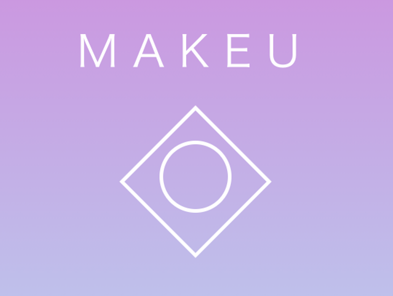
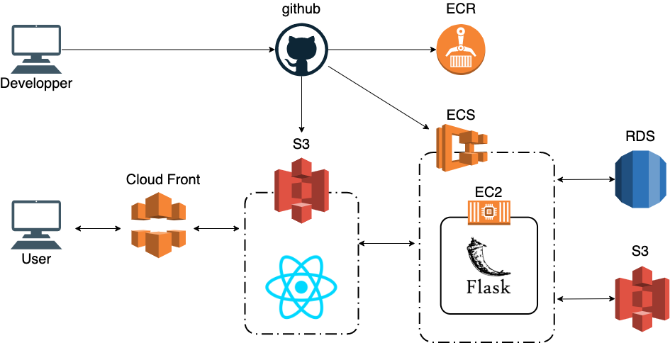

# MAKEU

## 製品概要

**動画**

https://drive.google.com/file/d/1cSYKLTuz20LUQgDggwFbOcbyVrsodDtH/view?usp=sharing

**試用版**

https://dsr6soc5f8pbf.cloudfront.net/

※ サーバーのスペックの問題でややタイムラグがあるかもしれません

※ テンプレートの登録機能が利用できません

### 背景(製品開発のきっかけ、課題等）

現在、メイクは男女を問わず広い世代に浸透しているが、メイクはなかなか難しく、日によってばらつきが出たり、左右対象にできなかったりなど、自分の思い通りにいかないことがあります。私たちの周りでも、メイクがうまくいかない日があったり、そもそも、どういう風にやればいいのかよくわからないなどといった声を周りで聞くことがよくありました。得意な子に教えてもらったり、インターネットなどで情報を得たりすることができるが、与えられた情報通りにできるかと言われれば、みんながみんなできるわけではありません。そのため、リアルタイムにメイクをサポートするアプリケーションを開発することにしました。

### 製品説明（具体的な製品の説明）

MAKEU はメイクをリアルタイムにサポートするツールです。

メインの機能としては、リアルタイムでの補助線やテンプレートの表示です。眉テンプレートの表示、リップ、チーク、ハイライトの補助線をメイク中の動画に重ねて表示します。また、メイクに重要なパーソナルカラーの診断機能も追加しており、自分がどのタイプなのかを簡単に診断できます。 実装方法としては、WebRTC を利用して、ブラウザからリアルタイムで動画を取得し、バックエンドで顔の各パーツを検出し、必要な情報をレンダリングして返します。顔の検出・顔の各パーツの検出には OpenCV、Dlib を利用しています。また、パーソナルカラーの診断には Pytorch で独自のモデルを構築しています。

### 特長

#### 1. リアルタイムで補助線を表示

#### 2. メイク後の画像からテンプレートの作成

#### 3. メイクに重要なパーソナルカラーの診断機能

### 解決出来ること

- メイクのばらつきの緩和
- メイクの時の自分の感覚と実際の差異を少なくする
- メイクのハードルを下げる

### 今後の展望

- 自分のメイクのテンプレートなどの共有機能
- テンプレートの追加
- 色ムラなどの検出
- 髪型

### 注力したこと（こだわり等）

- リアルタイム性を重視
  - バックエンドで画像を処理しているので、どうしても補助線のレンダリングに時間がかかってしまうが、なるべくストレスがなく利用できるようにした
- デプロイ作業の自動化

## 開発技術

### 活用した技術

#### フレームワーク・ライブラリ・モジュール

- フロント
  - React, WebRTC
- バックエンド
  - Flask, OpenCV, Dlib, Pytorch
- インフラなど
  - Docker, AWS(ECS, S3, Cloud Front, RDS, ALB, Route53), Github Actions

#### 構成図

### 独自技術

#### ハッカソンで開発した独自機能・技術

- パーソナルカラー判定モデル(https://github.com/jphacks/C_2013/tree/master/ml/parsonalcolor_detection)
- テンプレート画像の合成(https://github.com/jphacks/C_2013/blob/master/backend/controller/template_controller.py)
- https://github.com/jphacks/C_2013/blob/master/front/src/containers/VideoPage.js
